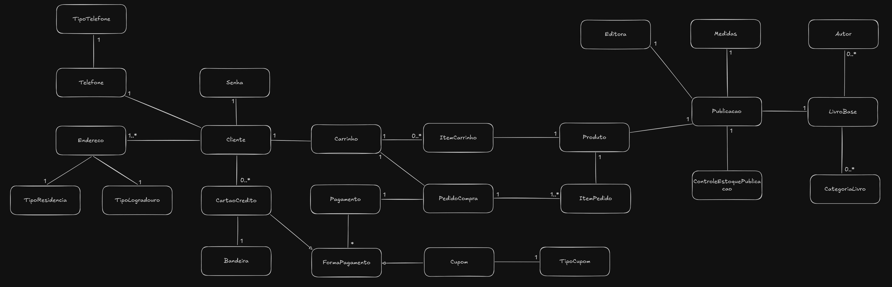

- Um mesmo livro pode ser publicado diversas vezes;
  - Nova publicação = novo ISBN;
  - Novo ISBN = novo código de barras;

- `ItemPedido` deve persistir snapshot do preço do `Produto` no momento da finalização do pedido;

### TODO:
- Alterar relação de `Publicacao` e `Produto`;
  - `Publicacao` deve herdar de `Produto`;
- Criar entidade `PedidoTroca`;
  - Deve ser criado um novo pedido para cada item a ser trocado;
- Criar entidades de `Status` para `PedidoCompra` e `PedidoTroca`;